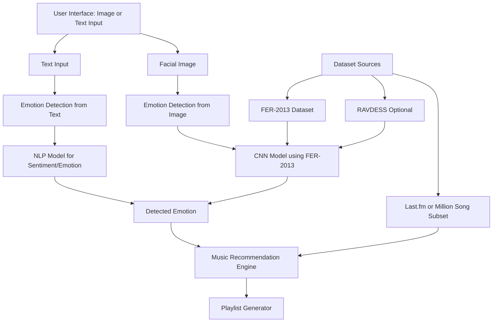

# MoodMate Architecture

## High-Level Flow

## Module View

1. Data collection and preprocessing:
   - FER-2013 image normalization, split handling, augmentation.
   - Last.fm/Million Song cleaning (tags, genre, tempo, mood words).
2. Emotion detection:
   - Text model path (baseline -> BERT/LSTM).
   - Image model path (baseline -> CNN).
3. Recommendation:
   - Emotion-to-tag mapping.
   - Content similarity via TF-IDF + cosine similarity.
4. UI:
   - Upload image / type text.
   - Show detected emotion + ranked tracks.
5. Evaluation:
   - Classification metrics for emotion model.
   - Recommendation precision/coverage and qualitative relevance.
